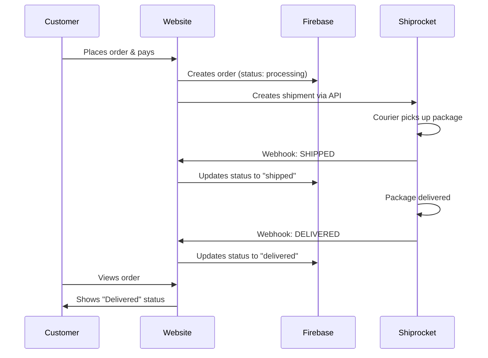

# Shiprocket Webhook Setup Guide

## Overview
This guide explains how to set up Shiprocket webhooks to automatically update order status in your database.

## What Are Webhooks?
Webhooks are automatic notifications sent by Shiprocket to your server whenever an order status changes (shipped, delivered, etc.). This keeps your database synchronized without manual updates.

## Webhook Endpoint Created
✅ **File:** `api/shiprocket-webhook.js`
✅ **URL:** `https://your-domain.vercel.app/api/shiprocket-webhook`

## Status Mapping
The webhook automatically maps Shiprocket statuses to your order statuses:

| Shiprocket Status | Your Order Status |
|-------------------|-------------------|
| PICKUP SCHEDULED  | processing        |
| SHIPPED           | shipped           |
| OUT FOR DELIVERY  | shipped           |
| DELIVERED         | delivered         |
| CANCELLED         | cancelled         |
| RTO (Return)      | cancelled         |

## Setup Instructions

### Step 1: Deploy to Vercel
1. Push your code to GitHub
2. Deploy to Vercel
3. Note your production URL (e.g., `https://prasannasorinuts.vercel.app`)

### Step 2: Register Webhook in Shiprocket Dashboard

1. **Login to Shiprocket**
   - Go to https://app.shiprocket.in/
   - Login with your credentials

2. **Navigate to Settings → Webhooks**
   - Click on your profile icon (top right)
   - Select "Settings"
   - Find "Webhooks" in the left menu

3. **Add New Webhook**
   - Click "Add Webhook" button
   - Fill in the details:

   **Webhook URL:**
   ```
   https://your-domain.vercel.app/api/shiprocket-webhook
   ```
   Replace `your-domain` with your actual Vercel domain

   **Events to Subscribe:**
   - ☑️ Order Shipped
   - ☑️ Order Delivered
   - ☑️ Order Cancelled
   - ☑️ Pickup Scheduled
   - ☑️ RTO (Return to Origin)

   **Method:** POST

4. **Save Webhook**
   - Click "Save" or "Add Webhook"
   - Shiprocket will verify the endpoint

### Step 3: Test the Webhook

**Option 1: Place a Test Order**
1. Create a test order through your website
2. Complete payment
3. Shiprocket will create shipment automatically
4. When status changes, webhook will be triggered
5. Check your database to verify status updated

**Option 2: Test from Shiprocket Dashboard**
1. Go to an existing order in Shiprocket
2. Manually change status to "Shipped"
3. Check your order in Firebase
4. Status should update automatically

### Step 4: Monitor Webhook Logs

**In Shiprocket:**
- Go to Settings → Webhooks
- Click on your webhook
- View "Webhook Logs" to see all triggers and responses

**In Vercel:**
1. Go to your Vercel project
2. Click "Logs" tab
3. Filter by `/api/shiprocket-webhook`
4. See real-time webhook processing logs

## How It Works



## What Gets Updated Automatically

When webhook is received, the following fields are updated:

```javascript
{
  orderStatus: 'shipped' | 'delivered' | 'cancelled',
  shiprocketAwbCode: 'AWB123456789',
  courierName: 'Delhivery',
  trackingId: 'tracking_url',
  updatedAt: timestamp
}
```

## Troubleshooting

### Webhook Not Working?

1. **Check Vercel Logs**
   ```bash
   # In Vercel dashboard, check function logs
   ```

2. **Verify Webhook URL**
   - Make sure it's the correct production URL
   - Ensure HTTPS (not HTTP)
   - No trailing slash

3. **Check Shiprocket Webhook Logs**
   - Look for failed requests
   - Check error messages

4. **Test Manually**
   ```bash
   curl -X POST https://your-domain.vercel.app/api/shiprocket-webhook \
     -H "Content-Type: application/json" \
     -d '{
       "order_id": "test123",
       "current_status": "SHIPPED",
       "awb_code": "AWB123",
       "courier_name": "Test Courier"
     }'
   ```

### Common Issues

**Issue 1: Order not found**
- Solution: Make sure order_id matches exactly

**Issue 2: Status not updating**
- Solution: Check Firebase security rules allow updates
- Verify FIREBASE_SERVICE_ACCOUNT_KEY in Vercel env variables

**Issue 3: Webhook returns 500 error**
- Solution: Check Vercel logs for specific error
- Ensure Firebase Admin SDK is properly initialized

## Security Considerations

✅ Webhook endpoint is public (Shiprocket needs to access it)
✅ Only accepts POST requests
✅ Validates order exists before updating
✅ Uses Firebase Admin SDK for secure database updates
✅ All updates are logged for audit trail

## Benefits of Webhooks

✅ **Automatic Updates** - No manual status changes needed
✅ **Real-time Sync** - Status updates instantly
✅ **Accurate Tracking** - Customer sees current status
✅ **Less Admin Work** - System handles everything
✅ **Better Experience** - Customers get live updates

## Next Steps

After setup:
1. ✅ Deploy webhook endpoint to Vercel
2. ✅ Register webhook URL in Shiprocket
3. ✅ Place a test order to verify
4. ✅ Monitor logs for first few days
5. ✅ Enjoy automated order tracking!

## Support

If you need help:
- Check Shiprocket documentation: https://apidocs.shiprocket.in/
- Contact Shiprocket support for webhook issues
- Check Vercel logs for errors
- Review Firebase console for data issues
